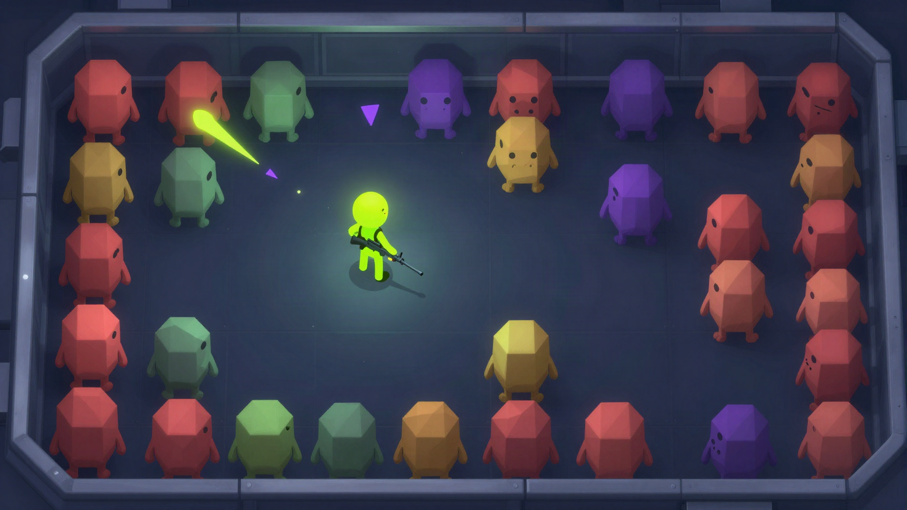

# One Room, 100 Monsters

A single-room, top-down survival game built with Canvas, CSS, and vanilla JavaScript. Hold the room, collect experience, upgrade your build, and see how long you last.



*Higgsfield-generated concept art for the game.*

## Features

- One responsive arena with procedural Canvas visuals
- Keyboard, touch, and gamepad controls with automatic device detection
- Five enemy archetypes: Drifter, Skitter, Brute, Spitter, and Nestling; plus the Warden elite
- Experience drops, level-up choices, 18 run upgrades, healing and overdrive pickups
- Escalating waves and a 100-monster milestone event
- Score, run statistics, and a locally saved personal best
- Pause, settings, generated sound effects, fullscreen, and reduced-effects options
- Responsive layouts for phones, tablets, and landscape screens
- An offline iPhone/iPad app wrapper and downloadable unsigned IPA build
- No build step, server, image downloads, or third-party runtime dependencies

## Controls

| Input | Action |
| --- | --- |
| WASD or arrow keys | Move |
| Mouse | Aim |
| Left click (hold) | Fire |
| Space | Dash with brief invulnerability |
| Esc | Pause or resume |
| 1, 2, or 3 | Choose a level-up upgrade |
| Touch screen | Left virtual stick moves; right stick aims and fires; Dash and Pause buttons |
| Gamepad | Left stick moves; right stick aims; A / Cross fires; B / Circle dashes; Menu pauses |

Use the **Input** selector in the top bar to choose automatic detection, touch, gamepad, keyboard, or VR theater. Gamepad input is detected automatically in Auto mode. VR theater fills the browser display with the 2D game; this Canvas game does not currently provide stereoscopic rendering or head tracking.

## iPhone and iPad app

Every push to `main` builds the unsigned iOS app on a macOS runner. Download the IPA from the [iOS app page](https://lukayara.github.io/One-room-100-monsters./downloads/) or from that run's **Artifacts** section. The app bundles the game for offline play, opens in landscape on iPhone, supports both orientations on iPad, and hides system chrome during play. The bundle identifier is `com.lukayara.oneroom100monsters`.

The IPA is intentionally unsigned. Before installing it, sign it with an Apple distribution/development identity and a provisioning profile that matches the bundle identifier and intended devices; a certificate by itself does not authorize installation on iOS devices. See [ios/README.md](ios/README.md) for building and signing notes.

## Run locally

Open `index.html` in a modern browser. For a local web server, run this from the project folder:

```sh
python -m http.server 8000
```

Then visit `http://localhost:8000`.

## Deploy to GitHub Pages

The `main` branch is deployed with `.github/workflows/deploy.yml`. That workflow builds the unsigned iOS app on macOS, publishes the static game and an IPA download page to GitHub Pages, and saves a 30-day workflow artifact. Set **Settings → Pages → Build and deployment → Source** to **GitHub Actions** if needed.

## Project structure

```text
index.html       Page shell and game UI
style.css        Menus, HUD, and theme
device.css       Responsive layouts and touch controls
src/game.js      Game loop, Canvas rendering, combat, progression, and saves
README.md        Setup and deployment instructions
LICENSE          MIT license
.github/workflows/deploy.yml  Build the iOS app and publish game + IPA on main pushes
ios/OneRoom/                Native WKWebView wrapper and app icon
```

## Development notes

- The main simulation uses a fixed logical canvas size and delta-time updates, with large frame deltas clamped after tab switches.
- All artwork and short arcade sound effects are drawn/generated in the browser. Google Fonts are an optional visual enhancement; system fallbacks are included.
- The only persistent data is the versioned high score and settings in browser `localStorage`. If storage is unavailable, the game continues without saving.
- The Warden appears on wave 5. Reaching 100 kills awards a score bonus and heal, then calls in an elite if one is not already active.

## Credits

Original game code and procedural visuals. Fonts: Barlow Condensed and DM Mono (loaded from Google Fonts when online).

## License

MIT. See [LICENSE](LICENSE).

## Known limitations

- High scores and settings are stored per browser, not synced between devices.
- Sound effects are synthesized; there is no music track.
- VR theater is a fullscreen 2D view; immersive stereoscopic rendering and tracked VR motion are not implemented.

## Future improvements

Music, immersive VR rendering, additional elite patterns, and more run modifiers.
